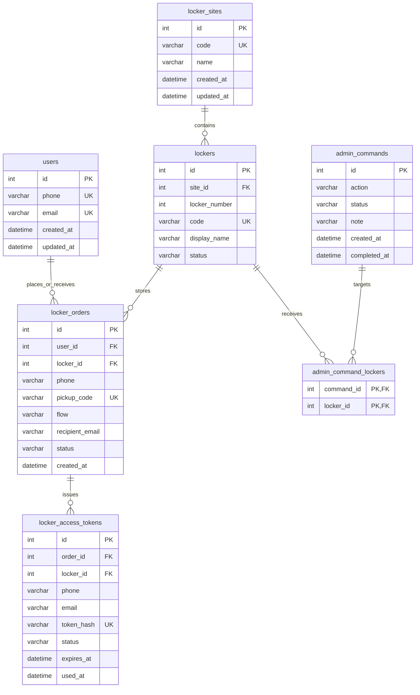

# Smart Locker ERD

This schema keeps the current operating flow intact while making the database relationships explicit enough for MySQL Workbench EER diagrams.

## Important Behavior

- `users.email` is nullable so an order can still be created before the recipient registers an email.
- `locker_orders.user_id` is nullable for legacy data, but new orders create or reuse a `users` row by `phone`.
- `locker_orders.phone` and `locker_orders.recipient_email` stay as snapshots so the old pickup and email history flows keep working.
- `locker_access_tokens.phone` and `locker_access_tokens.email` also stay as snapshots of the delivery moment.
- `admin_command_lockers` stores one or many target lockers for admin commands; `admin_commands.note` remains for human notes and backward compatibility.

## Indexes For Growth

- `users(phone)` and `users(email)` support registration and lookup.
- `locker_orders(user_id, created_at)` supports user history.
- `locker_orders(locker_id, status)` supports active locker occupancy.
- `locker_orders(phone, created_at)` keeps the current phone lookup flow fast.
- `locker_access_tokens(order_id, status)` supports revoking and validating pickup links.
- `admin_commands(status, created_at)` supports pending command polling.

## MySQL Workbench

Use `Database -> Reverse Engineer...` against the `smartlocker` schema. Workbench should now draw these relationships automatically because they are real foreign keys in `mysql_schema.sql` and the SQLAlchemy models.
