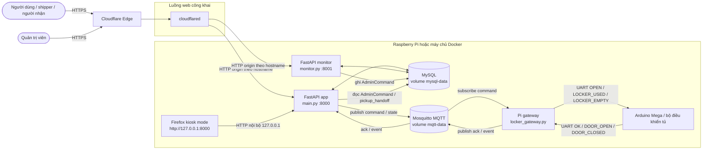

# Hình 3.1 - Kiến trúc và luồng dữ liệu tổng quát của hệ thống

## Giải thích chi tiết

### 1. Tầng web và giao diện

Người dùng, shipper và quản trị viên chỉ làm việc với hệ thống qua web:

- `app.smartlocker...` đi vào `main.py`
- `monitor.smartlocker...` đi vào `monitor.py`
- kiosk chạy Firefox với tùy chọn `--kiosk` và truy cập `http://127.0.0.1:8000` đến `main.py`

Điều này có nghĩa `HTTP/HTTPS` là giao thức cho giao diện, form, API và dashboard.

### 2. Tầng dữ liệu nghiệp vụ

`main.py` và `monitor.py` cùng dùng chung MySQL để đồng bộ:

- đơn hàng trong `locker_orders`
- email người dùng trong `user_accounts`
- token nhận hàng trong `locker_access_tokens`
- lệnh quản trị và handoff trong `admin_commands`

MySQL là nơi lưu trạng thái nghiệp vụ lâu dài, còn giao diện kiosk chỉ là lớp hiển thị.

### 3. Tầng điều khiển phần cứng

Từ app đến phần cứng, code không gọi UART trực tiếp. Luồng thực tế là:

1. `main.py` publish lệnh `open` hoặc `set_occupied` lên MQTT.
2. Mosquitto giữ vai trò broker trung gian.
3. `locker_gateway.py` trên Raspberry Pi subscribe topic lệnh.
4. Gateway đổi lệnh MQTT thành chuỗi UART gửi cho Arduino Mega.
5. Mega phản hồi `OK`, `DOOR_OPEN`, `DOOR_CLOSED`.
6. Gateway publish lại ACK hoặc event về MQTT để app biết kết quả.

Nhờ vậy, tầng web không phụ thuộc chặt vào giao thức UART của vi điều khiển.

### 4. Vì sao kiến trúc này là hybrid

Hệ thống này là hybrid vì nó dùng nhiều giao thức cho nhiều mục đích khác nhau:

- `HTTPS` cho truy cập từ Internet và quản trị từ xa
- `HTTP` cho route nội bộ giữa Cloudflare Tunnel, Firefox kiosk và FastAPI
- `MQTT` cho điều khiển thiết bị theo mô hình publish/subscribe
- `UART` cho kết nối vật lý Raspberry Pi với Arduino Mega
- `MySQL` cho lưu trữ và đồng bộ trạng thái nghiệp vụ

## Điểm cần nhấn mạnh khi báo cáo

- Cloudflare Tunnel chỉ publish dịch vụ web, không thay thế MySQL hay MQTT.
- MQTT không thay thế UART; nó chỉ tách app web khỏi thiết bị chấp hành.
- Khi `SMARTLOCKER_HARDWARE_ENABLED=false`, app có thể giả lập thao tác mở tủ để demo nghiệp vụ.
- Cách tách tầng này giúp dễ thay broker, dễ thay gateway, hoặc chuyển từ Arduino Mega sang bộ điều khiển khác mà ít ảnh hưởng tầng web.

## Đối chiếu mã nguồn

- [`docker-compose.yml`](../../docker-compose.yml)
- [`cloudflared/config.docker.yml`](../../cloudflared/config.docker.yml)
- [`main.py`](../../main.py)
- [`monitor.py`](../../monitor.py)
- [`locker_hardware.py`](../../locker_hardware.py)
- [`locker_gateway.py`](../../locker_gateway.py)

## Tài liệu tham khảo

- [Cloudflare Tunnel](https://developers.cloudflare.com/tunnel/)
- [MQTT Version 3.1.1 - OASIS Open](https://docs.oasis-open.org/mqtt/mqtt/v3.1.1/os/mqtt-v3.1.1-os.html)
- [Eclipse Paho Python Client](https://eclipse.dev/paho/clients/python/)
- [Eclipse Mosquitto Documentation](https://mosquitto.org/documentation/)
